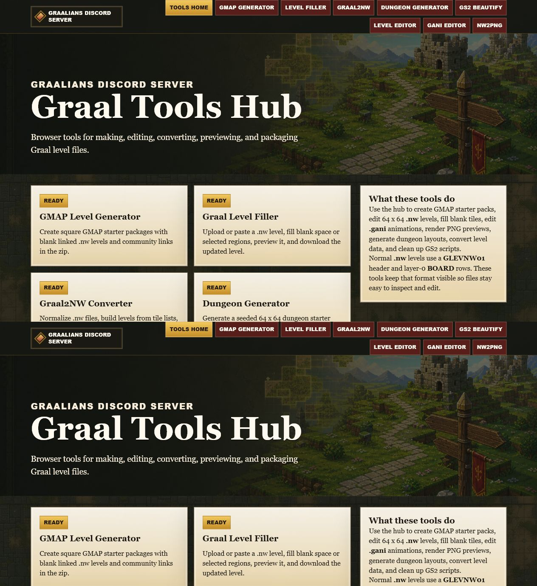
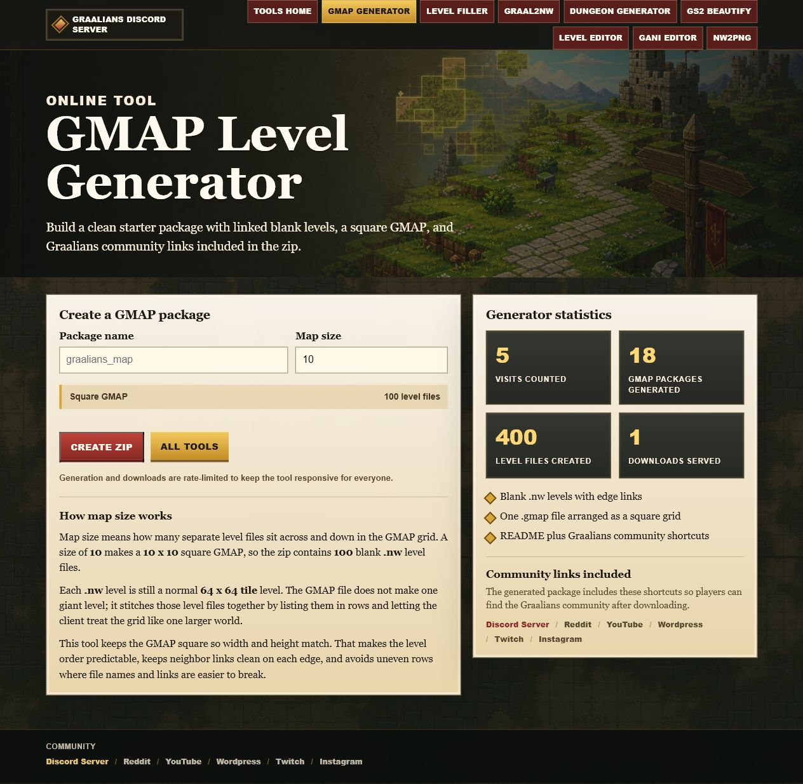
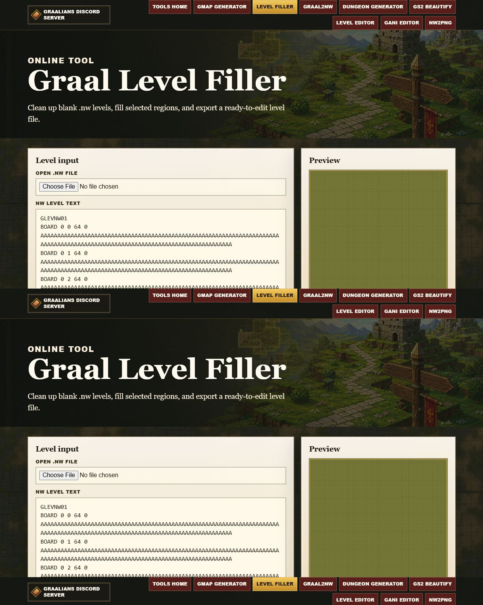
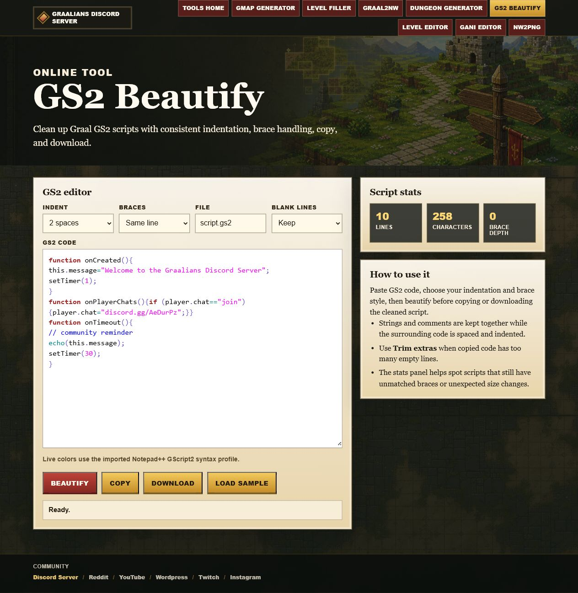

# Graalians Discord Server Tool Hub

A public collection of GraalOnline development tools, browser utilities, source code, and preserved working references maintained for the Graalians community.

The project covers **GMAP generation**, **`.nw` level utilities**, **GANI animation editing/viewing**, **GS2 formatting**, level previews, conversion tools, and historical/reference implementations that can help with Graal development and preservation.

> **Live-site files are included and ready for GitHub Pages.** The repository itself is already public and all downloads below work directly from GitHub. GitHub Pages still has to be enabled for this repository before the `rice2k.github.io` site becomes active.

## Quick Links

- **Repository:** https://github.com/rice2k/Graalians-Discord-Server-Tool-Hub
- **Download the complete project:** https://github.com/rice2k/Graalians-Discord-Server-Tool-Hub/archive/refs/heads/main.zip
- **Downloads page:** `downloads.html`
- **Browser GMAP Generator:** `generatelevels.html`
- **Planned live URL:** https://rice2k.github.io/Graalians-Discord-Server-Tool-Hub/
- **Graalians Discord:** https://discord.gg/AeDurPz

## Download Options

| Download | Description |
| --- | --- |
| [Complete Tool Hub ZIP](https://github.com/rice2k/Graalians-Discord-Server-Tool-Hub/archive/refs/heads/main.zip) | Latest copy of the entire project from the `main` branch. |
| [GANI Editor working source](https://raw.githubusercontent.com/rice2k/Graalians-Discord-Server-Tool-Hub/main/reference-tools/packages/gani-edit-working-source.zip) | Known-working browser GANI editor source used as a behavioral reference. |
| [GMAP Generator working source](https://raw.githubusercontent.com/rice2k/Graalians-Discord-Server-Tool-Hub/main/reference-tools/packages/graal-gmap-generator-working-source.zip) | Known-working C# GMAP generator source, tests, project files, and template data. |
| [GraalViewer2 source](reference-tools/GraalViewer2-source/) | Browseable C# GANI viewer/parser source. |
| [Reference tool documentation](reference-tools/README.md) | Attribution, package hashes, dependency notes, and intended use. |

Developers can also clone the repository:

```bash
git clone https://github.com/rice2k/Graalians-Discord-Server-Tool-Hub.git
```

## Browser Edition

The repository now includes a static GitHub Pages-compatible edition.

### GMAP Level Generator

`generatelevels.html` works without PHP. It creates the package locally in the visitor's browser and downloads the finished ZIP.

A generated package contains:

- A `.gmap` world-layout file.
- Blank 64 × 64 `.nw` level files.
- Neighbor links for valid top, bottom, left, and right edges.
- A package README.
- Graalians community shortcut files.

A map size of `10` creates a **10 × 10 GMAP consisting of 100 individual `.nw` levels**.

The browser generator does not need to upload the user's generated map files to this repository.

## Tools Included

| Tool | Main file | Status | Purpose |
| --- | --- | --- | --- |
| Tool Hub | `index.html` / `index.php` | Browser landing page + PHP edition | Central navigation and project information. |
| GMAP Generator | `generatelevels.html` / `generatelevels.php` | Browser-ready + PHP edition | Creates linked GMAP starter packages. |
| Graal Level Filler | `graal-level-filler.php` | PHP edition | Opens or pastes `.nw` data and fills blank tiles or selected regions. |
| Graal2NW Converter | `graal2nw-converter.php` | PHP edition | Normalizes and converts supported Graal level data to `.nw`. |
| Dungeon Generator | `dungeon-generator.php` | PHP edition | Generates seeded 64 × 64 dungeon starter levels. |
| GS2 Beautify | `gs2-beautify.php` | PHP edition | Formats GS2 scripts and provides GScript2-style highlighting. |
| Level Editor | `level-editor.php` | PHP edition | Browser interface for painting and exporting `.nw` levels. |
| GANI Editor | `gani-editor.php` | PHP edition + working reference | Opens, edits, previews, and exports `.gani` animation data. |
| NW2PNG | `nw2png.php` | PHP edition | Renders `.nw` BOARD data to PNG previews. |
| Downloads | `downloads.html` | Static | Public download page for the complete project and reference tools. |

## Working Reference Implementations

Known-working implementations are kept under [`reference-tools/`](reference-tools/) so the themed Tool Hub can be improved against proven behavior without overwriting the web tools with unrelated desktop/runtime files.

### GANI Editor reference

The supplied browser editor is useful for checking:

- GANI parsing and serialization.
- Sprite definitions and resource images.
- Animation frames and direction data.
- Frame hold timing.
- Single-direction animations.
- Loop, freeze, and `SETBACKTO` behavior.

### GraalViewer2 reference

The preserved C# source is useful for checking:

- GANI loading and parsing.
- Animation frame progression.
- Sprite rendering.
- Image/resource loading.
- Viewer/window behavior.

Generated `bin/` and `obj/` folders were not carried into the reference source. The older project contains legacy SFML.NET reference paths that should be made portable before rebuilding on a modern machine.

### C# GMAP Generator reference

The preserved GMAP source is useful for comparing:

- GMAP dimensions and level ordering.
- Level filenames.
- Generated level contents.
- Neighbor links.
- Template behavior.
- Existing test expectations.

## PHP Edition / Local Setup

For the full PHP tool set, use a PHP-capable server such as XAMPP.

1. Download or clone this repository.
2. Place it under your web server directory, for example XAMPP `htdocs`.
3. Open `index.php` through the local web server.
4. Enable PHP `ZipArchive` for the server-side GMAP ZIP generator.

Example:

```text
http://127.0.0.1/Graalians-Discord-Server-Tool-Hub/index.php
```

Runtime-generated maps and statistics are intentionally kept separate from the public source repository.

## Screenshots

### Tool Hub



### GMAP Generator



### Level Filler



### GS2 Beautify



## Project Topics

The repository is tagged for easier discovery with:

`graal` · `graalonline` · `graalians` · `gmap` · `gani` · `nw-levels` · `gs2` · `level-editor` · `javascript` · `php` · `tool-hub`

Useful search phrases include **Graal tools**, **GraalOnline development tools**, **GANI editor**, **GMAP generator**, **Graal NW level editor**, **GS2 formatter**, and **Graal level utilities**.

## Project Structure

```text
.
├── index.html                  # Static/public Tool Hub
├── downloads.html              # Public download center
├── generatelevels.html         # Static browser GMAP generator
├── index.php                   # PHP Tool Hub
├── generatelevels.php          # PHP GMAP generator
├── graal-level-filler.php
├── graal2nw-converter.php
├── dungeon-generator.php
├── gs2-beautify.php
├── level-editor.php
├── gani-editor.php
├── nw2png.php
├── tools_common.php
├── graal-tools.js
├── graalians-tools.css
├── docs/
└── reference-tools/
    ├── README.md
    ├── GraalViewer2-source/
    └── packages/
        ├── gani-edit-working-source.zip
        └── graal-gmap-generator-working-source.zip
```

## Project Status

The repository is public and downloadable. The static browser version and GitHub Pages deployment workflow are committed to `main`. The GitHub repository currently reports Pages as disabled, so the Pages publishing source must be enabled in the repository's **Settings → Pages** before the public `github.io` URL can serve the site.

Once enabled, pushes to `main` are configured to redeploy the static site automatically.

## Community

- Discord: https://discord.gg/AeDurPz
- Reddit: https://reddit.com/r/graal
- YouTube: https://www.youtube.com/@GraalDiscord
- WordPress: https://graaldisocrd.wordpress.com/
- Twitch: https://www.twitch.tv/rice2k
- Instagram: https://www.instagram.com/Graal_Discord/

## Notes on Third-Party Code

Reference sources are preserved for research, compatibility, and development comparison. No new license is asserted over third-party code. Preserve original notices and verify applicable upstream redistribution terms before republishing or relicensing third-party material.

## Contributing

Bug reports, compatibility findings, documentation corrections, and improvements to Graal file-format handling are welcome through the GitHub repository.
